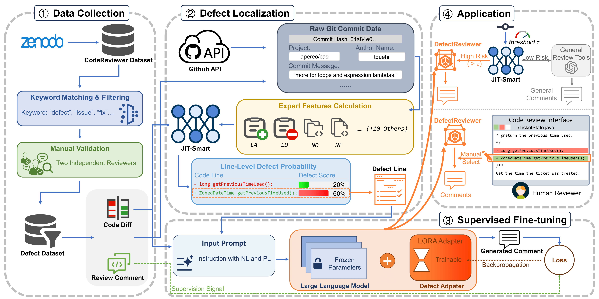

# DefectReviewer

This repository contains the implementation and experimental code of the paper:

**DefectReviewer: Towards Generating Defect-Focused Review Comment Based on Fine-Grained Defect Localization**




📁 Project Structure
```
.
├── configs/ # Configuration files for training and inference
├── data/ # Preprocessed datasets and data-related utilities
├── environment.yml # Conda environment specification
├── inference.py # Inference script for review comment generation
├── metrics/ # Evaluation metrics (e.g., BLEU, ROUGE-L)
├── models/ # Model definitions and wrappers
├── trainers/ # Training logic and trainer utilities
├── utils/ # Helper functions (logging, I/O, preprocessing)
├── train.py # Training entry point
└── Overview.jpg # Overview of the proposed approach
```

⚙️ Setup
1. Clone the repository

2. Create Conda environment

```conda env create -f environment.yml```

📦 Dataset

```unzip data/dataset.zip -d data/```

🧠 Models

DefectReviewer supports multiple pre-trained language models for code review comment generation. Pre-trained models (e.g., CodeLLaMA or DeepSeek-Coder) can be obtained from public model repositories such as HuggingFace by specifying the corresponding model identifiers in the configuration files. Fine-tuned model checkpoints should be placed in the appropriate directories as specified in the configs.

🚀 Training

To train DefectReviewer, run:

```accelerate launch train.py```

Training behavior (model choice, localization signals, hyperparameters) can be configured via files in the configs/ directory.

📊 Evaluation Metrics

Metrics are computed automatically after inference.

🙋 Contact

Feel free to open an issue or contact us if you have any questions or feedback.

